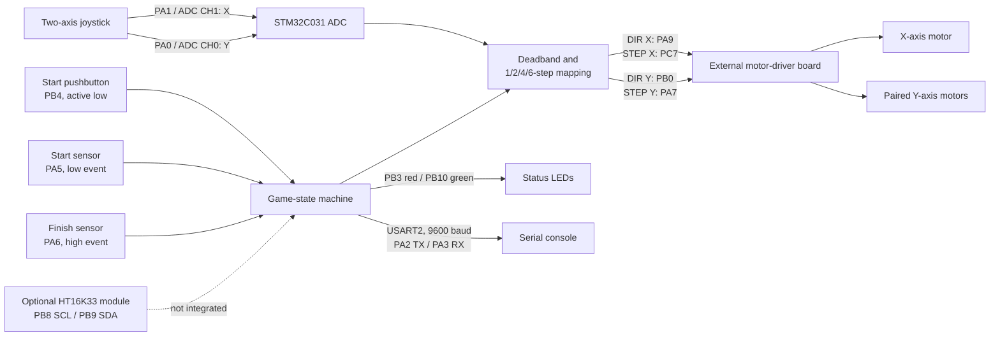

# STM32 Two-Axis Marble Maze Controller

Bare-metal firmware for a joystick-controlled, two-axis tilting marble maze built around an STM32C031 Nucleo-class target. The controller reads two analog joystick axes, translates joystick displacement into step bursts, and drives a separate motor-control board through step/direction signals. A pushbutton starts the game, discrete sensors report departure from the start and arrival at the goal, LEDs communicate state, and UART output provides diagnostics.

This repository is a source snapshot rather than a complete, portable STM32CubeIDE project. The game loop and supporting peripheral modules are present, but the device headers, project headers, startup code, linker script, and generated make fragments required for a standalone build are not included. See [Build and validation](#build-and-validation) and [Limitations](#limitations-and-unfinished-features).

## System problem

The mechanism tilts a physical maze about two axes so a player can steer a marble with a joystick. The embedded controller must:

- acquire two 12-bit analog joystick channels;
- reject small neutral-position noise with a deadband;
- convert larger joystick displacement into faster step commands;
- respect the external motor controller's step/direction interface;
- sequence the game from idle through countdown and play to completion; and
- observe the start and finish sensors without flooding the diagnostic output.

The mechanical assembly uses three physical motors: one for one tilt axis and two mechanically paired motors for the other. The driver board abstracts those motors into two logical step/direction channels, so the STM32 firmware controls X and Y as two axes.

## Architecture



## Hardware and pin mapping

The mapping below is taken directly from the register configuration and call sites in the source. Signal polarity for the two maze sensors is preserved from the existing logic and should be confirmed on the physical system.

| Function | STM32 pin / peripheral | Direction | Firmware interpretation |
| --- | --- | --- | --- |
| Joystick X | PA1 / ADC channel 1 | Analog input | Above midpoint selects one direction; magnitude selects burst size |
| Joystick Y | PA0 / ADC channel 0 | Analog input | Above midpoint selects one direction; magnitude selects burst size |
| X direction | PA9 | Digital output | Direction level for the X channel |
| X step | PC7 | Digital output | One rising edge requests one X step |
| Y direction | PB0 | Digital output | Direction level for the Y channel |
| Y step | PA7 | Digital output | One rising edge requests one Y step |
| Start pushbutton | PB4 with internal pull-up | Digital input | Active low |
| Start-zone sensor | PA5, no internal pull | Digital input | A low level is logged once as departure |
| Finish sensor | PA6, no internal pull | Digital input | A high level ends the game |
| Red status LED | PB3 | Digital output | On while waiting and after timeout |
| Green status LED | PB10 | Digital output | On while running and after success |
| UART2 TX / RX | PA2 / PA3, AF1 | Serial | 9600 baud at an assumed 12 MHz peripheral clock |
| Optional I2C1 SCL / SDA | PB8 / PB9, AF6 | Open-drain bus | Support code exists for sensors/display, but is not used by `main.c` |

The firmware assumes a 12 MHz system and peripheral clock. `SysTick` is configured for a 1 ms tick, and UART baud calculation uses the same fixed clock assumption.

## Joystick and motor control

Each pass through `RUNNING` samples X and then Y. The nominal 12-bit midpoint is `2048`; readings within `100` counts of center produce no motion. Outside that deadband, absolute displacement determines the number of steps issued per loop:

| Distance from midpoint | Steps per loop |
| ---: | ---: |
| 101–300 | 1 |
| 301–600 | 2 |
| 601–1000 | 4 |
| Above 1000 | 6 |

Each step is generated synchronously in software. The direction output is changed immediately before the step signal is raised; step is then high for 1 ms and low for 1 ms. Consecutive rising edges are therefore separated by approximately 2 ms (about 500 Hz), below the project specification's 1 kHz maximum. Minimum direction setup/hold and pulse-width requirements still need to be checked against the driver specification. When both axes request motion, all X steps are completed before any Y steps, so motion is blocking, non-concurrent, and variable in latency.

GPIO outputs currently use read-modify-write operations on `ODR`. The accompanying firmware audit proposes atomic `BSRR` writes, along with other corrections, but this documentation-only revision intentionally leaves the source unchanged until it can be compiled and hardware-tested.

## Game-state machine

```text
INIT --low button sample + 100 ms delay--> READY --3-second countdown--> RUNNING
                                                            |
                                                   finish sensor high
                                                            |
                                                            v
                                                        FINISHED

TIMEOUT exists in the enum and switch, but no transition enters it.
```

- `INIT`: turns on red, turns off green, waits for an active-low button sample, and delays 100 ms. It does not confirm the input remains low after the delay.
- `READY`: prints a prompt and performs a blocking three-count LED countdown.
- `RUNNING`: samples the joystick, issues step bursts, reports the first start-zone departure, and watches the finish sensor.
- `FINISHED`: reports success, sets the LEDs, and intentionally remains in an infinite loop.
- `TIMEOUT`: contains failure indication code but is unreachable because no timer is started, no elapsed-time limit is defined, and no transition assigns this state.

## Repository structure

| File | Role and integration status |
| --- | --- |
| `main.c` | Active GPIO setup, game state machine, joystick mapping, motor pulse generation, sensor handling, and LED behavior |
| `adc.c` | Polling ADC initialization, channel selection, resolution, and conversion |
| `uart.c` | Polling USART2 setup plus `printf` character retargeting |
| `sysinit.c` | 1 ms SysTick timebase and blocking millisecond delay |
| `SevenSeg.c` | HT16K33 numeric/hex formatting and writes; present but not initialized or called by the game |
| `i2c.c` | Polling I2C1 transactions used by optional display and accelerometer modules |
| `lsm303agr.c` | Optional LSM303AGR accelerometer access; not used by the game |
| `tim.c` | TIM16 periodic-interrupt and TIM14 PWM helpers; not used by the game |
| `rpm.c` | One-second, blocking pulse-count/RPM helper on PA1; not used and conflicts with joystick X if enabled |
| `makefile` | Generated STM32CubeIDE build fragment with external, machine-specific dependencies |
| `.gitignore` | Embedded build, IDE, editor, and OS-generated exclusions |
| `FIRMWARE_AUDIT.md` | Documentation-only source audit, proposed corrections, rationale, and required validation |

## Technical decisions

- **Direct CMSIS register access:** the code does not depend on STM32 HAL calls, keeping the control path small but tying it closely to STM32C0 register definitions.
- **Position-to-rate approximation:** joystick magnitude selects discrete burst sizes instead of continuously calculating a motor velocity.
- **Deadband around center:** a 100-count threshold suppresses neutral joystick noise and minor calibration offset.
- **Polling architecture:** ADC, UART, I2C, button waiting, countdown, motor pulses, and terminal states all use blocking waits. This is simple, but it limits responsiveness and extensibility.
- **External step/direction driver:** the firmware delegates phase sequencing and paired-motor control to the driver board.
- **Preserved sensor assumptions:** PA5 is treated as an active-low departure indication and PA6 as an active-high finish indication because that is what the source implements; electrical validation is still required.

## Completed functionality

At source level, the active game implements:

- explicit GPIO modes for motor, LED, button, and maze-sensor signals;
- 12-bit polling ADC reads for two joystick axes;
- joystick deadband and four discrete motion rates;
- direction, step, and LED output control through GPIO registers;
- a blocking step pulse waveform of approximately 500 Hz, below the documented 1 kHz maximum;
- an active-low button wait followed by a 100 ms debounce delay;
- a blocking three-second countdown with red LED flashes;
- start-zone logging while the departure input remains active, which can repeat every loop;
- finish-sensor transition to a terminal win state; and
- polling UART diagnostics at 9600 baud.

The repository also contains standalone support routines for an HT16K33 display, I2C, LSM303AGR acceleration, timers/PWM, and RPM measurement. Their presence does not mean they are active in the maze application.

## Limitations and unfinished features

- **Timeout is not implemented.** `TIMEOUT` is unreachable. `READY` contains a `TODO` to start a timer, and no deadline or state transition exists.
- **The seven-segment display is not integrated.** Countdown, `DONE`, and `FAIL` display operations remain TODOs. `main.c` neither initializes I2C nor calls the `SevenSeg` module.
- **The repository is not build-complete.** Required headers such as `stm32c0xx.h`, `ES28.h`, `ADC.h`, and module headers are absent, as are startup sources, generated `sources.mk`/`objects.mk` fragments, and the linker script.
- **The checked-in makefile is machine-specific.** It references an absolute Windows linker-script path from the original STM32CubeIDE workspace.
- **Hardware behavior has not been exercised here.** Motor direction polarity, sensor polarity, pull-up requirements, LED polarity, mechanical travel limits, and driver timing margins require bench verification.
- **Motion is blocking and sequential.** Long step bursts defer sensor sampling, and X/Y commands are not interleaved.
- **Terminal states do not restart.** Both `FINISHED` and `TIMEOUT` remain in infinite loops until reset.
- **No travel limit or homing logic is present.** The firmware assumes the mechanical system and operator keep motion within safe bounds.
- **ADC calibration and sampling-time setup are absent.** Conversion uses device defaults beyond resolution/channel selection.
- **Polling peripheral helpers can wait forever.** UART, ADC, and I2C routines have no error or timeout path.
- **Auxiliary conflicts exist if unused modules are enabled.** `rpm.c` assigns PA1 to its sensor, while the active game uses PA1 for joystick X. `tim14_pa7_pwm_init()` assigns PA7 to timer PWM, while the game uses PA7 as the Y step output.

## Setup and build requirements

The source targets an STM32C031C6Tx-class Cortex-M0+ device and was generated around GNU Tools for STM32 13.3.rel1. To reconstruct a build:

1. Install STM32CubeIDE or an equivalent Arm GNU toolchain with CMSIS device support for STM32C0.
2. Create or restore an STM32C031C6Tx project configured for the board's 12 MHz clock assumption.
3. Restore the missing project headers, CMSIS device files, startup assembly, linker script, and generated make fragments.
4. Add these C sources to the project, resolving the project-specific declarations supplied by `ES28.h` and the missing module headers.
5. Replace the absolute linker-script path in `makefile` with a project-relative path, or regenerate the build system from STM32CubeIDE.
6. Confirm the pin mapping and voltage/pull configuration against the Nucleo shield and driver-board schematics before powering the motors.
7. Connect motor power as required by the driver hardware, flash the target, and monitor USART2 at 9600 baud.

## Build and validation

Static review can confirm register usage, state transitions, pin assignments, and that the generated pulse routine requests approximately one rising edge per 2 ms. A full compile cannot be performed from this snapshot alone because its required headers, startup files, linker script, and generated dependency fragments are missing.

Before hardware deployment, validate with an oscilloscope or logic analyzer:

- direction setup time and step high/low timing on both axes;
- the external driver's exact maximum/minimum timing requirements;
- start and finish sensor polarity and idle stability;
- joystick endpoints, center offset, and desired deadband;
- correct mechanical direction for both logical axes; and
- behavior at mechanical travel limits.

No claim is made here that the timeout or seven-segment user interface works; both remain unfinished.
